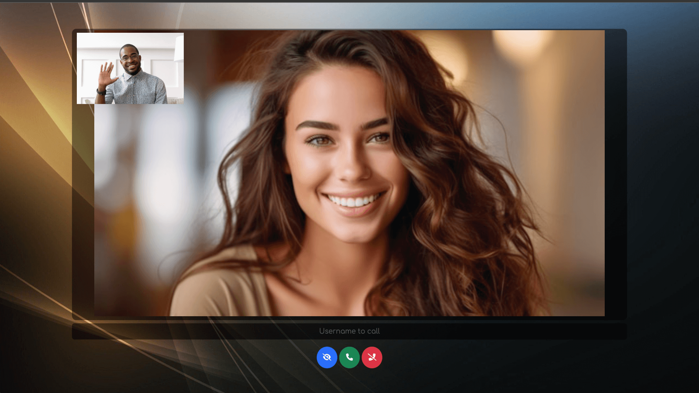

# Call-Me

This project enables easy one-to-one video calls directly from your web browser using WebRTC technology.



## Getting Started

### Overview

This project allows you to:

- `End-to-End Encryption` for secure and private communications.
- `Join` with a username or enter a name to `Call now`.
- `Set your preferred language`.
- `Initiate video calls` by clicking the call button next to a recipient’s username.
- `Switch between cameras, microphones, and speakers` during a call.
- `Chat in real time` with participants.
- `Hide your video` feed when needed.
- `Toggle your microphone` (mute/unmute).
- `Toggle your camera` (video on/off).
- `Share your screen` (start/stop).
- `Share files` with other participants.
- `Hang up the call` when finished.
- `Enable Host Protection` mode with a password.
- `Enable Web Push Notifications` to get notified of incoming calls even when the app is in the background.
- `Use the REST API` to retrieve the list of connected users or initiate a call.

---

### Quick Start

- #### Using NodeJs


**[Install Node.js and npm](https://nodejs.org/en/download)**

```shell
# Clone this repo
git clone https://github.com/miroslavpejic85/call-me.git

# Go to to dir call-me
cd call-me

# Copy the config file
$ cp public/config.template.js public/config.js

# Copy .env.template to .env
cp .env.template .env

# Install dependencies
npm install

# Start the application
npm start
```

---

- #### Using Docker


Install [docker engine](https://docs.docker.com/engine/install/) and [docker compose](https://docs.docker.com/compose/install/)

```shell
# Clone this repo
git clone https://github.com/miroslavpejic85/call-me.git

# Go to to dir call-me
cd call-me

# Copy .env.template to .env
cp .env.template .env

# Create your own docker-compose.yml
cp docker-compose.template.yml docker-compose.yml

# Get official image from Docker Hub
docker-compose pull

# Create and start containers
docker-compose up
```

---

1. `Open` your browser and visit [http://localhost:8000](http://localhost:8000).

2. `Join` with your username or `Call` directly the recipient.

3. `Select` the connected recipient's username and click `Call`.

4. `Enjoy` your one-to-one video call.

---

## Click to Call

Allows a user to `join` the room as a `user1`

- [http://localhost:8000/join?user=user1](http://localhost:8000/join?user=user1) (dev)
- [https://cme.mirotalk.com/join?user=user1](https://cme.mirotalk.com/join?user=user1) (prod)

Lets the `user2 join` the room and initiate a `call` to the `user1`

- [http://localhost:8000/join?user=user2&call=user1](http://localhost:8000/join?user=user2&call=user1) (dev)
- [https://cme.mirotalk.com/join?user=user2&call=user1](https://cme.mirotalk.com/join?user=user2&call=user1) (prod)

You can explore a `widget` example that demonstrates this functionality [here](./integration/widget.html).

---

<details open>
<summary>Self-Hosting</summary>

</br>


## **Requirements**

- A clean server running **Ubuntu 22.04 or 24.04 LTS**
- **Root access** to the Server
- A **domain or subdomain** pointing to your server’s public IPv4

---

## Note

When **prompted**, simply **enter your domain or subdomain**. Then wait for the installation to complete.

```bash
# Install
wget -qO cme-install.sh https://docs.mirotalk.com/scripts/cme/cme-install.sh \
  && chmod +x cme-install.sh \
  && ./cme-install.sh
```

```bash
# Uninstall
wget -qO cme-uninstall.sh https://docs.mirotalk.com/scripts/cme/cme-uninstall.sh \
  && chmod +x cme-uninstall.sh \
  && ./cme-uninstall.sh
```

```bash
# Update
wget -qO cme-update.sh https://docs.mirotalk.com/scripts/cme/cme-update.sh \
  && chmod +x bro-update.sh \
  && ./cme-update.sh
```

</details>

---

## Fast Integration


Easily integrate `Call-Me` into your website or application with a [simple iframe](https://codepen.io/Miroslav-Pejic/pen/qEWBaKP). Just add the following code to your project:

```html
<iframe
    allow="camera; microphone; speaker-selection; fullscreen; clipboard-read; clipboard-write; web-share; autoplay"
    src="https://cme.mirotalk.com/"
    style="width: 100vw; height: 100vh; border: 0px;"
></iframe>
```

---

## API

Get all connected users

```shell
# Get all connected users
curl -X GET "http://localhost:8000/api/v1/users" -H "authorization: call_me_api_key_secret" -H "Content-Type: application/json"
curl -X GET "https://cme.mirotalk.com/api/v1/users" -H "authorization: call_me_api_key_secret" -H "Content-Type: application/json"

# Generate call links for connected users to call
curl -X GET "http://localhost:8000/api/v1/connected?user=call-me" -H "authorization: call_me_api_key_secret" -H "Content-Type: application/json"
curl -X GET "https://cme.mirotalk.com/api/v1/connected?user=call-me" -H "authorization: call_me_api_key_secret" -H "Content-Type: application/json"
```

Docs: http://localhost:8000/api/v1/docs/ or you can check it out live in prod [here](https://cme.mirotalk.com/api/v1/docs/).

---


